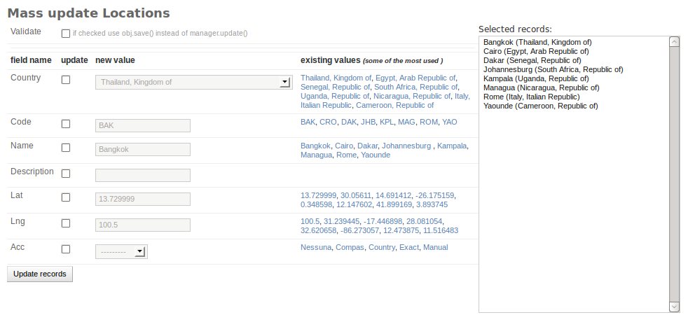
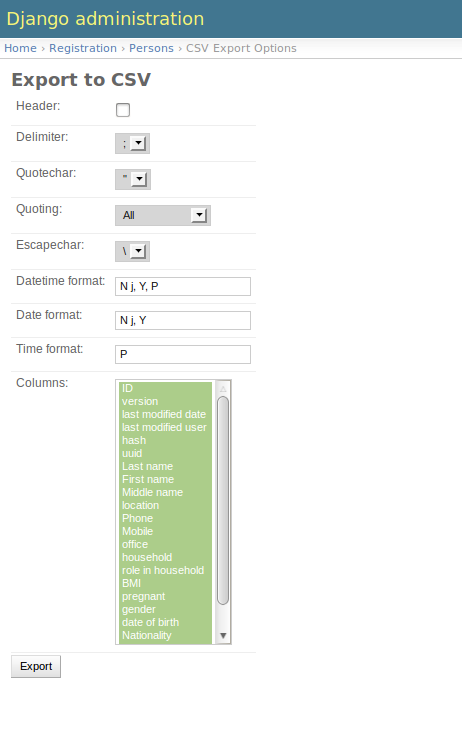
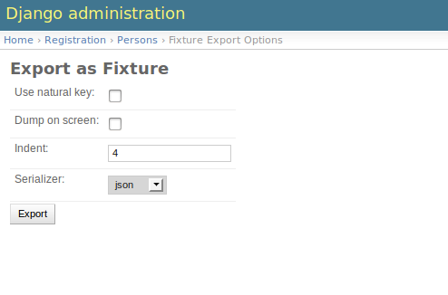
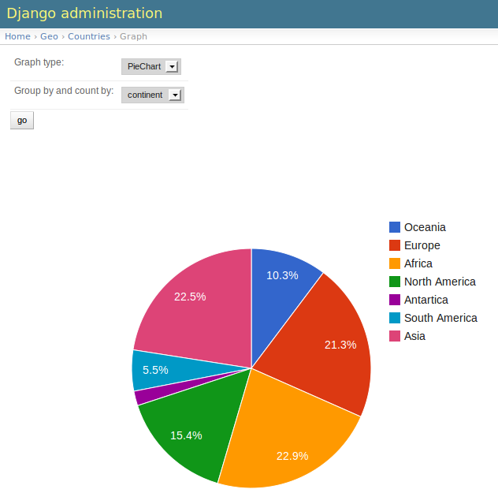
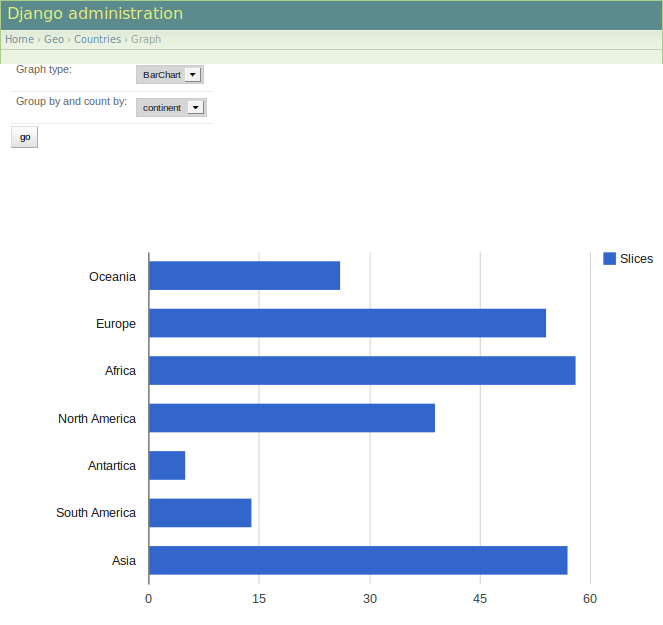

.. include:: globals.rst

:tocdepth: 2

.. _actions:

=======
Actions
=======

.. contents::
    :local:

.. _massupdate:

``Mass Update``
===============

Update one or more fields of the selected queryset to a common value.

===================   ===========================================================================================
**validate**          use obj.save() instead of obj._default_manager.update.
                      Slower but usefule if you need to run some business logic in save() and clean()
===================   ===========================================================================================

**Screenshot**

.. _export_csv:

``Export as CSV``
=================

Export selected queryset as csv file. (see :ref:`csv <python:csv-contents>`)

Available options: (see :ref:`python:csv-fmt-params`)

===================   ===========================================================================================
**header**            add the header line to the file

**delimiter**         A one-character string used to separate fields.
                      It defaults to ','. (see :py:attr:`csv.Dialect.delimiter`)

**quotechar**         A one-character string used to quote fields containing special
                      characters, such as the delimiter or quotechar, or which contain new-line characters.
                      It defaults to '"'.  (see :py:attr:`csv.Dialect.quotechar`)

**quoting**           Controls when quotes should be generated by the writer and recognised by the
                      reader. (see :py:attr:`csv.Dialect.quoting`)

**escapechar**        A one-character string used by the writer to escape the *delimiter*. (see :py:attr:`csv.Dialect.escapechar`)

**datetime_format**   How to format datetime field. (see :ref:`strftime and strptime Behavior <python:strftime-strptime-behavior>`)

**date_format**       How to format date field. (see :ref:`strftime and strptime Behavior <python:strftime-strptime-behavior>`)

**time_format**       How to format time field. (see :ref:`strftime and strptime Behavior <python:strftime-strptime-behavior>`)

**columns**           Which columns will be included in the dump

===================   ===========================================================================================

**Screenshot**

.. _export_fixture:

``Export as Fixture``
=====================

Export selected queryset as fixtures using any registered :ref:`Serializer <django:serialization>`.

.. note:: this is not equal to django command ``dumpdata`` because dumps also the Foreignkeys

===================   =============================================================
**use natural key**   If true use natural keys.
                      (see :ref:`Natural Keys <django:deserialization-of-natural-keys>`)

**dump on screen**    Dump on screen instead to show ``Save as`` popup

**indent**            Indentation value

**serializer**        Serializer to use. (see :ref:`Serialization formats <django:serialization-formats>`)

===================   =============================================================

**Screenshot**

.. _export_delete_tree:

``Export Delete Tree``
======================

.. versionadded:: 0.0.5

Export all the records that belong selected queryset using any registered :ref:`Serializer <django:serialization>`.

This action is the counterpart of `export_fixture`_, where it dumps the queryset and it's ForeignKeys,
`export_delete_tree`_ dumps all the records that belongs the selected queryset.

===================   =============================================================
**use natural key**   If true use natural keys.
                      (see :ref:`Natural Keys <django:deserialization-of-natural-keys>`)

**dump on screen**    Dump on screen instead to show ``Save as`` popup

**indent**            Indentation value

**serializer**        Serializer to use. (see :ref:`Serialization formats <django:serialization-formats>`)

===================   =============================================================

**Screenshot**

.. _graph:

``Graph Queryset``
==================

Graph selected queryset.

===========================     =============================================================
**Graph type**                  Graph type to use

**Group by and count by:**      Grouping field
===========================     =============================================================

**Screenshot**

**Screenshot**

