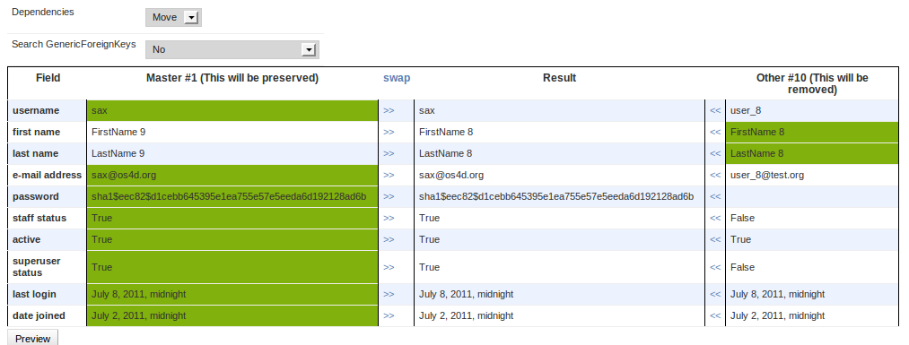
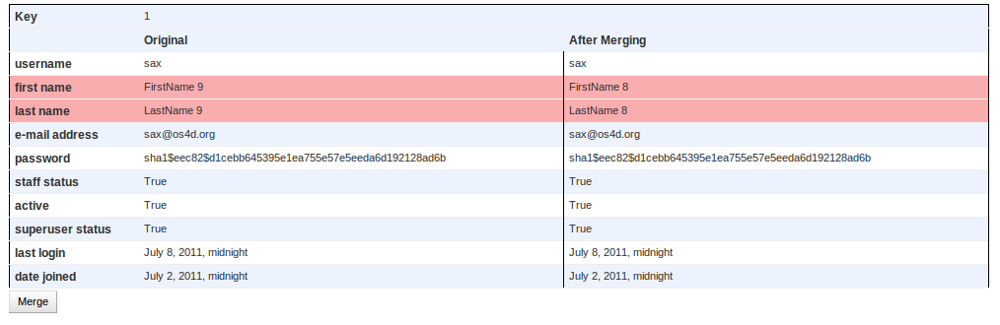

.. include:: globals.rst

:tocdepth: 2

.. _actions:

=======
Actions
=======

.. contents::
    :local:
    :depth: 1

.. _massupdate:

``Mass Update``
===============

Update one or more fields of the selected queryset to a common value and/or apply a
`transform_operations`_ to selected field.

======================= ===========================================================================================
**validate**            use obj.save() instead of obj._default_manager.update.
                        Slower but required in some cases (To run some business logic in save() and clean()
                        Manadatory if use :ref:`transform_operations`
**unique_transaction**  .. versionadded:: 0.0.4
======================= ===========================================================================================

**Screenshot**

.. figure:: _static/mass_update.png

.. _transform_operations:

``Transform Operation``
------------------------
.. versionadded:: 0.0.4

Is possible to update fields applying function. |app| comes with a predefined set of functions.
You can anyway :ref:`register your own functions <register_transform_function>`

**common to all models**
~~~~~~~~~~~~~~~~~~~~~~~~

    =============       ======================================================================
    set                 set the value
    set null            set the value to null (only available if the field has null=True
    =============       ======================================================================

:class:`django:django.db.models.CharField`
~~~~~~~~~~~~~~~~~~~~~~~~~~~~~~~~~~~~~~~~~~

    ==========  ======================================
    upper       convert to uppercase
    lower       convert to lowercase
    capitalize  capitalize first character
    capwords    capitalize each word
    swapcase    swap the case
    trim        remove leading and trailing whitespace
    ==========  ======================================

:class:`django:django.db.models.IntegerField`
~~~~~~~~~~~~~~~~~~~~~~~~~~~~~~~~~~~~~~~~~~~~~~

    ===========  ===================================================================
    add          add the value passed as arg to the current value of the field
    sub          subtract the value passed as arg to the current value of the field
    add_percent  add the `X` percent to the current value
    sub_percent  subtract the `X` percent from the current value
    ===========  ===================================================================

:class:`django:django.db.models.BooleanField`
~~~~~~~~~~~~~~~~~~~~~~~~~~~~~~~~~~~~~~~~~~~~~~

    ==========  =================================
    swap        invert (negate) the current value
    ==========  =================================

:class:`django:django.db.models.NullBooleanField`
~~~~~~~~~~~~~~~~~~~~~~~~~~~~~~~~~~~~~~~~~~~~~~~~~

    ==========  =================================
    swap        invert (negate) the current value
    ==========  =================================

:class:`django:django.db.models.EmailField`
~~~~~~~~~~~~~~~~~~~~~~~~~~~~~~~~~~~~~~~~~~~

    =============  ======================================
    change domain  set the domain (@?????) to common value
    =============  ======================================

:class:`django:django.db.models.URLField`
~~~~~~~~~~~~~~~~~~~~~~~~~~~~~~~~~~~~~~~~~~

    =============  ==========================================
    change domain  set the protocol (????://) to common value
    =============  ==========================================

.. _export_as_csv:

``Export as CSV``
=================

Export selected queryset as csv file. (see :ref:`csv <python:csv-contents>`)

Available options: (see :ref:`python:csv-fmt-params`)

===================   ===========================================================================================
**header**            add the header line to the file

**delimiter**         A one-character string used to separate fields.
                      It defaults to ','. (see :py:attr:`csv.Dialect.delimiter`)

**quotechar**         A one-character string used to quote fields containing special
                      characters, such as the delimiter or quotechar, or which contain new-line characters.
                      It defaults to '"'.  (see :py:attr:`csv.Dialect.quotechar`)

**quoting**           Controls when quotes should be generated by the writer and recognised by the
                      reader. (see :py:attr:`csv.Dialect.quoting`)

**escapechar**        A one-character string used by the writer to escape the *delimiter*. (see :py:attr:`csv.Dialect.escapechar`)

**datetime_format**   How to format datetime field. (see :ref:`strftime and strptime Behavior <python:strftime-strptime-behavior>`)

**date_format**       How to format date field. (see :ref:`strftime and strptime Behavior <python:strftime-strptime-behavior>`)

**time_format**       How to format time field. (see :ref:`strftime and strptime Behavior <python:strftime-strptime-behavior>`)

**columns**           Which columns will be included in the dump

===================   ===========================================================================================

**Screenshot**

.. figure:: _static/export_as_csv.png

.. _export_as_fixture:

``Export as Fixture``
=====================

Export selected queryset as fixtures using any registered Serializer.

.. note:: this is not the same as django's command ``dumpdata`` because it can dump also the Foreign Keys.

====================   ========================================================================================
**use natural key**    If true use natural keys.

**dump on screen**     Dump on screen instead to show ``Save as`` popup

**indent**             Indentation value

**serializer**         Serializer to use. (see :ref:`Serialization formats <django:serialization-formats>`)

**add_foreign_keys**   If checked export foreign keys too, otherwise act as standard dumpdata

====================   ========================================================================================

**Screenshot**

.. figure:: _static/export_as_fixture.png

.. _export_delete_tree:

``Export Delete Tree``
======================
.. versionadded:: 0.0.4

Export all the records that belong selected queryset using any registered Serializer.

This action is the counterpart of `export_as_fixture`_, where it dumps the queryset and it's ForeignKeys,
`export_delete_tree`_ all the records that belong to the entries of the  selected queryset.
see `export_as_fixture`_ for details

====================   =====================================================================================
**use natural key**    If true use natural keys.

**dump on screen**     Dump on screen instead to show ``Save as`` popup

**indent**             Indentation value

**serializer**         Serializer to use. (see :ref:`Serialization formats <django:serialization-formats>`)

**add_foreign_keys**   If checked export dependent objects too.

====================   =====================================================================================

**Screenshot**

.. figure:: _static/export_as_fixture.png

.. _export_as_xls:

``Export as Excel``
===================

.. versionadded:: 0.3

Export selected queryset as Excel (xls) file.

Available options:

===================   ===========================================================================================
**header**            add the header line to the file

**columns**           Which columns will be included in the dump

===================   ===========================================================================================

.. _graph_queryset:

``Graph Queryset``
==================

Graph selected queryset.

===========================     =============================================================
**Graph type**                  Graph type to use

**Group by and count by:**      Grouping field
===========================     =============================================================

**Screenshot**

.. figure:: _static/graph_pie.png

**Screenshot**

.. figure:: _static/graph_bar.png

.. _merge:

``Merge Records``
==================

.. versionadded:: 0.1

Sometimes you need to *"merge"* two records maybe because they represent the same business object
but were create double by mistake.
This action allow you to selectively merge two records and move dependencies
from one record to the other one.

**Screenshots**

Step 1
------

Step 2
------

