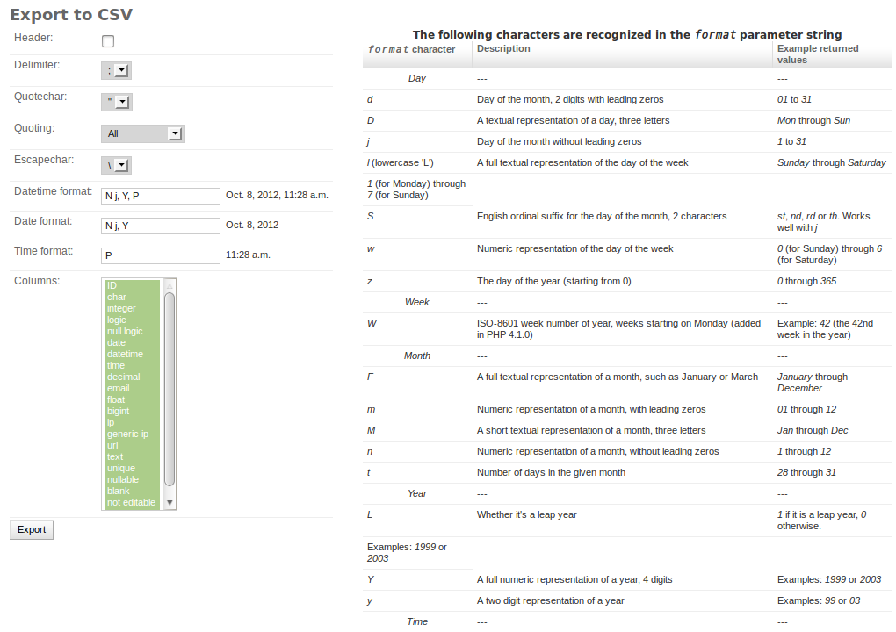

# Export as CSV

Export selected queryset as csv file. (see [csv][])

Available options: (see [csv][csv]).

!!!note
    Are you looking for the [export_as_csv](api.md#export_as_csv)

|                     |                                                                                                                                                                                                           |
|---------------------|-----------------------------------------------------------------------------------------------------------------------------------------------------------------------------------------------------------|
| **header**          | add the header line to the file                                                                                                                                                                           |
| **delimiter**       | A one-character string used to separate fields. It defaults to `,`. (see [csv.Dialect.delimiter][])                                                                                                       |
| **quotechar**       | A one-character string used to quote fields containing special characters, such as the delimiter or quotechar, or which contain new-line characters. It defaults to `"`.  (see [csv.Dialect.quotechar][]) |
| **quoting**         | Controls when quotes should be generated by the writer and recognised by the reader. (see [csv.Dialect.quoting][])                                                                                        |
| **escapechar**      | A one-character string used by the writer to escape the *delimiter*. (see [csv.Dialect.escapechar][])                                                                                                     |
| **datetime_format** | How to format datetime field. (see [strftime][datetime.date.strftime] and [strptime][datetime.datetime.strptime])                                                                                         |
| **date_format**     | How to format date field. (see [strftime][datetime.date.strftime] and [strptime][datetime.datetime.strptime])                                                                                                       |
| **time_format**     | How to format time field. (see [strftime][datetime.date.strftime] and [strptime][datetime.datetime.strptime])                                                                                                       |
| **columns**         | Which columns will be included in the dump                                                                                                                                                                |

**Screenshot**

{ align=left }

## Customize Options Form

To customize OptionForm add `get_export_form(request, export_type)` to your ModelAdmin.
By default OptionForm is based on `export_type` argument:

- 'xls': `adminactions.forms.XLSOptions`
- 'csv': `adminactions.forms.CSVOptions`
- 'fixture': `adminactions.forms.FixtureOptions`
- 'delete': `adminactions.forms.FixtureOptions`

## Limit columns

To limit the columns that can be exported, you can add `get_exportable_columns(request, options)` to the ModelAdmin to returns
the list of the allowed columns, it should returns a list of `[(field_name, field_label),...]`

By default

    cols = [(f.name, f.verbose_name) for f in queryset.model._meta.fields + queryset.model._meta.many_to_many]

`options` is and instance of: `CSVOptions`, `XLSOptions` `FixtureOptions`

## Streaming CSV Response

When a very large/complex dataset is exported, it may take be useful to stream the response row by row instead of the whole file.

To enable this functionality by default, set the django ``settings.ADMINACTIONS_STREAM_CSV`` to ``True`` (default: ``False``).

Behind the scenes, this attaches an iterator as the response content (using a [StreamingHttpResponse][django.http.StreamingHttpResponse] *if django >= 1.6* and  [HttpResponse][django.http.HttpResponse] otherwise);
the iterator simply yields a new csv row for each queryset iteration.

The benefit of this approach is a shorter initial response which unblocks the customer from request/response and he is free to do other things while waiting for the download to finish.
