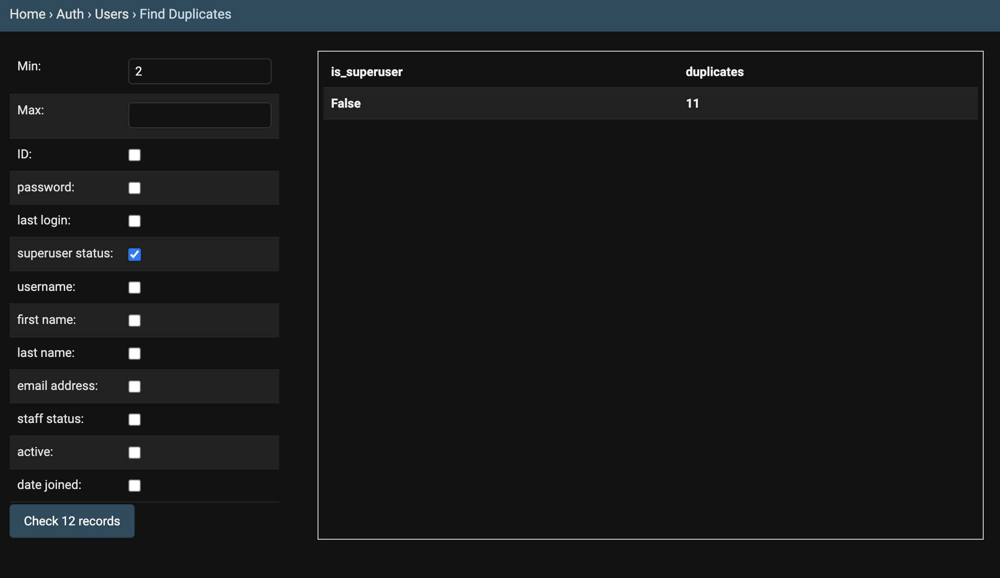

# Find Duplicates
<!-- sax:version 2.0 -->

Find duplicated records.

Note: This can be used to count records based on simple grouping

|||
|--------------------|------------------------------------------------------------------------------------------|
**min**             | only reports duplicates more than <value>
**max**             | only reports duplicates less than <value>
**fields**          | selection of fields to be used to detect duplicates

**Screenshots**

