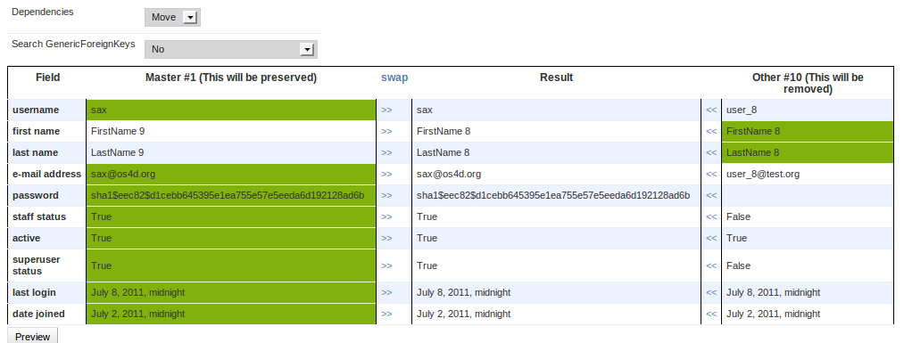
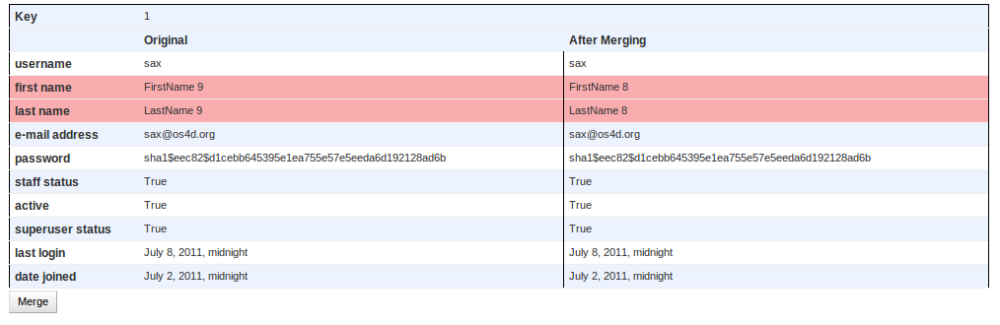

# Merge Records

<!-- sax:version 0.1 -->

Sometimes you need to *"merge"* two records maybe because they represent the same business object
but were create double by mistake.
This action allow you to selectively merge two records and move dependencies
from one record to the other one.

**Screenshots**

### Step 1

### Step 2

**Limitations/TODO**

- merge doesn't work for models related with ``on_delete=Protect`` (see :ghissue:`85`)

### Ignore Fields

<!-- sax:version 1.9 -->

It is possible to prevent some fields to be displayed to avoid merge.
To filter out some fields you need to set `MERGE_ACTION_IGNORED_FIELDS` settings parameter as follow::

    MERGE_ACTION_IGNORED_FIELDS = {
        'app_name': {
                'user': ['is_staff', 'is_superuser'],
        },
    }
